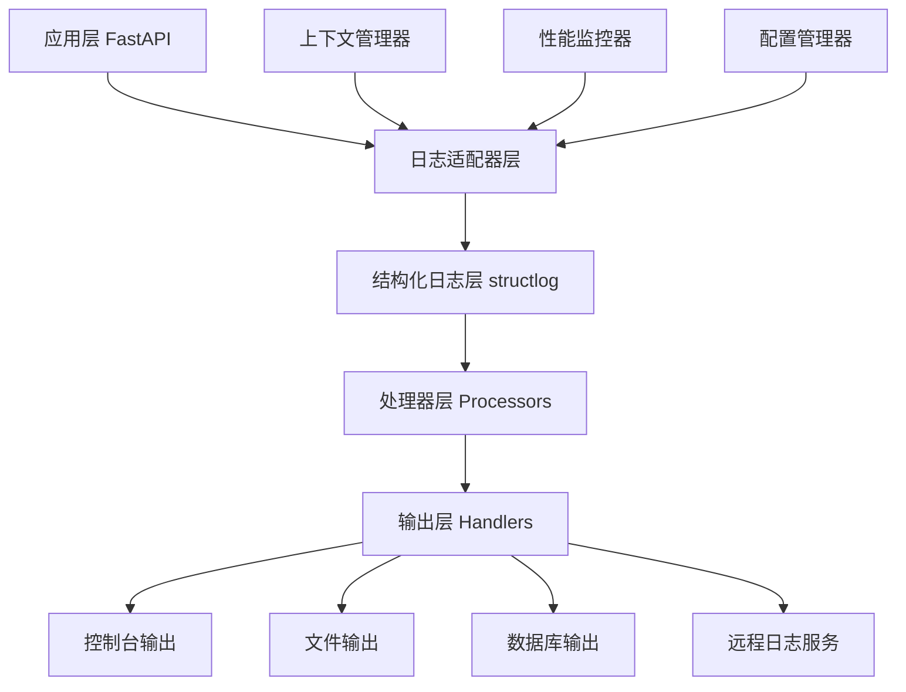
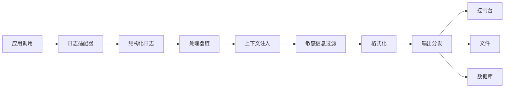

## Product Overview

创建一个完整的日志系统层，实现与Python标准库logging兼容的高级日志功能，提供结构化日志记录、多输出目标、日志级别控制、上下文追踪和性能监控能力。

## Core Features

- 兼容标准库logging的接口设计
- 结构化日志记录（JSON格式）
- 多种输出目标（控制台、文件、数据库）
- 可配置的日志级别控制
- 请求上下文追踪（correlation_id, user_id等）
- 性能监控和慢查询检测
- 日志轮转和归档功能
- 异步日志写入
- 日志过滤和敏感信息脱敏

## Tech Stack

- 核心框架: FastAPI + Python 3.8+
- 日志库: structlog + 标准库logging
- 数据库: PostgreSQL (通过MCP)
- 异步处理: asyncio
- 配置管理: Pydantic Settings
- 性能监控: 内置时间追踪器
- JSON处理: orjson (高性能)

## Architecture Design

### System Architecture



### Module Division

- **logger_adapter**: 适配器层，提供标准logging兼容接口
- **structured_logger**: 结构化日志核心，基于structlog
- **processors**: 日志处理器，包括时间戳、上下文、敏感信息过滤等
- **handlers**: 输出处理器，支持多种目标输出
- **context**: 上下文管理，追踪请求生命周期
- **performance**: 性能监控，记录执行时间和慢操作
- **config**: 配置管理，动态配置日志行为

### Data Flow



## Implementation Details

### Core Directory Structure

```
fastapi-complete-logging-system/
├── src/
│   ├── logging_system/
│   │   ├── __init__.py
│   │   ├── adapter.py          # 标准logging适配器
│   │   ├── structured_logger.py # 结构化日志核心
│   │   ├── processors/         # 日志处理器
│   │   │   ├── __init__.py
│   │   │   ├── context.py
│   │   │   ├── performance.py
│   │   │   └── security.py
│   │   ├── handlers/           # 输出处理器
│   │   │   ├── __init__.py
│   │   │   ├── console.py
│   │   │   ├── file.py
│   │   │   └── database.py
│   │   ├── context/            # 上下文管理
│   │   │   ├── __init__.py
│   │   │   └── request.py
│   │   ├── config/             # 配置管理
│   │   │   ├── __init__.py
│   │   │   └── settings.py
│   │   └── utils/              # 工具函数
│   │       ├── __init__.py
│   │       └── helpers.py
│   └── examples/
│       └── usage_examples.py
├── tests/
├── docs/
└── requirements.txt
```

### Key Code Structures

```python
# 日志适配器接口
class LoggingAdapter:
    def info(self, message: str, **kwargs): pass
    def error(self, message: str, **kwargs): pass
    def warning(self, message: str, **kwargs): pass
    def debug(self, message: str, **kwargs): pass

# 结构化日志配置
class StructuredLoggerConfig:
    level: str = "INFO"
    processors: List[Callable] = []
    handlers: List[Handler] = []
    context_vars: Dict[str, Any] = {}

# 上下文管理器
class LoggingContext:
    def bind(self, **kwargs): pass
    def unbind(self, *keys): pass
    def get_context(self) -> Dict[str, Any]: pass

# 性能监控装饰器
def log_performance(threshold_ms: float = 1000):
    def decorator(func): pass
```

### Technical Implementation Plan

#### 1. 标准logging兼容层

- **问题**: 需要与现有logging代码兼容
- **解决方案**: 创建适配器类，实现标准logging接口
- **实现步骤**: 

1. 定义LoggingAdapter基类
2. 实现各级别日志方法
3. 添加格式化支持
4. 集成structlog后端

#### 2. 结构化日志核心

- **问题**: 需要JSON格式输出和结构化数据
- **解决方案**: 基于structlog构建处理器链
- **实现步骤**:

1. 配置structlog处理器
2. 实现时间戳和上下文注入
3. 添加JSON格式化器
4. 支持自定义字段

#### 3. 多目标输出

- **问题**: 需要支持多种输出目标
- **解决方案**: 实现handler抽象类和具体实现
- **实现步骤**:

1. 定义Handler基类
2. 实现控制台handler
3. 实现文件handler（支持轮转）
4. 实现数据库handler

#### 4. 上下文追踪

- **问题**: 需要在请求生命周期内追踪上下文
- **解决方案**: 使用contextvars和中间件
- **实现步骤**:

1. 创建上下文存储机制
2. 实现FastAPI中间件
3. 自动注入请求ID等字段
4. 支持手动上下文绑定

### Integration Points

- **PostgreSQL集成**: 通过MCP存储日志数据
- **FastAPI集成**: 中间件自动日志记录
- **配置系统**: Pydantic Settings动态配置
- **异步支持**: 异步写入避免阻塞

## Agent Extensions

### MCP

- **PostgreSQL Multi-Schema MCP Server**
- Purpose: 存储结构化日志数据到PostgreSQL数据库
- Expected outcome: 实现数据库日志处理器，支持高性能日志存储和查询

### SubAgent

- **code-explorer**
- Purpose: 探索现有项目结构和日志实现
- Expected outcome: 分析当前structlog实现，确保新系统与现有代码兼容