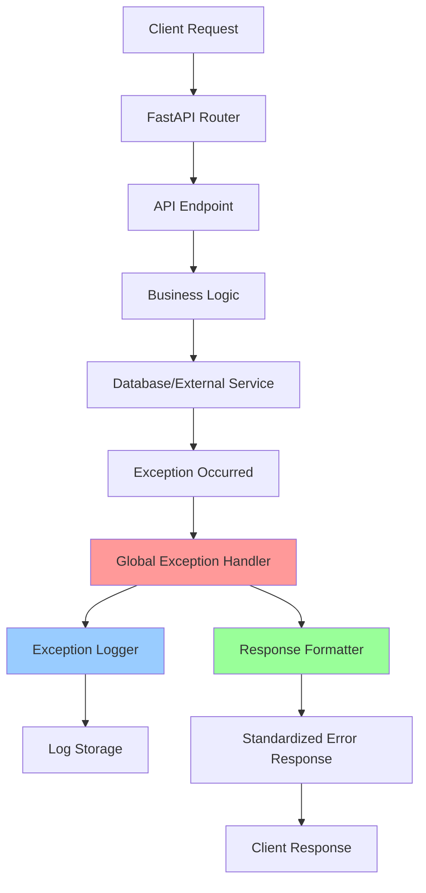
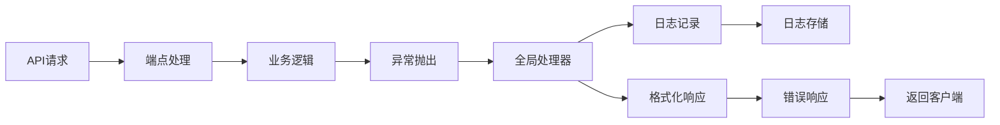

## Product Overview

为FastAPI应用建立完整的异常处理系统，包括自定义异常类、全局异常处理器、异常日志记录和统一错误响应格式。

## Core Features

- 自定义异常类体系：定义业务异常、验证异常、权限异常等自定义异常类型
- 全局异常处理器：统一捕获和处理应用中的所有异常
- 异常日志记录：详细记录异常信息，包括请求上下文和堆栈跟踪
- 统一错误响应格式：标准化API错误响应结构，包含错误码、消息和详细信息
- 异常监控集成：支持与外部监控系统集成

## Tech Stack

- 核心框架：FastAPI (Python)
- 异常处理：Python内置异常机制 + 自定义异常类
- 日志记录：Python logging模块 + 结构化日志
- 数据验证：Pydantic模型
- 中间件：FastAPI中间件机制
- 配置管理：Pydantic Settings

## System Architecture



## Module Division

- **exceptions模块**：自定义异常类定义
- **handlers模块**：全局异常处理器
- **logging模块**：异常日志记录器
- **responses模块**：统一响应格式定义
- **middleware模块**：异常捕获中间件

## Data Flow



## Implementation Details

### Core Directory Structure

```
fastapi-exception-handling-system/
├── src/
│   ├── exceptions/
│   │   ├── __init__.py
│   │   ├── base.py           # 基础异常类
│   │   ├── business.py       # 业务异常
│   │   ├── validation.py     # 验证异常
│   │   └── auth.py          # 权限异常
│   ├── handlers/
│   │   ├── __init__.py
│   │   ├── global_handler.py # 全局异常处理器
│   │   └── custom_handlers.py # 自定义处理器
│   ├── logging/
│   │   ├── __init__.py
│   │   ├── exception_logger.py # 异常日志记录器
│   │   └── formatters.py     # 日志格式化器
│   ├── responses/
│   │   ├── __init__.py
│   │   ├── error_response.py # 错误响应模型
│   │   └── success_response.py # 成功响应模型
│   ├── middleware/
│   │   ├── __init__.py
│   │   └── exception_middleware.py # 异常中间件
│   └── utils/
│       ├── __init__.py
│       └── error_codes.py   # 错误码定义
├── tests/
│   ├── test_exceptions.py
│   ├── test_handlers.py
│   └── test_integration.py
└── examples/
    └── demo_app.py
```

### Key Code Structures

```python
# 基础异常类
class BaseAPIException(Exception):
    def __init__(self, message: str, error_code: str, status_code: int = 500):
        self.message = message
        self.error_code = error_code
        self.status_code = status_code
        super().__init__(message)

# 业务异常
class BusinessLogicError(BaseAPIException):
    def __init__(self, message: str, error_code: str = "BUSINESS_ERROR"):
        super().__init__(message, error_code, 400)

# 全局异常处理器
async def global_exception_handler(request: Request, exc: Exception):
    if isinstance(exc, BaseAPIException):
        return await handle_api_exception(request, exc)
    else:
        return await handle_unexpected_exception(request, exc)

# 错误响应模型
class ErrorResponse(BaseModel):
    success: bool = False
    error_code: str
    message: str
    details: Optional[Dict[str, Any]] = None
    timestamp: datetime
    request_id: str
```

### Technical Implementation Plan

1. **自定义异常体系设计**

- 问题：需要建立层次化的异常类体系
- 解决方案：基于BaseAPIException创建各种业务异常子类
- 技术实现：Python继承机制，Pydantic验证
- 实施步骤：定义基类→创建业务异常→添加异常属性→实现序列化

2. **全局异常处理器**

- 问题：统一处理所有异常，避免代码重复
- 解决方案：使用FastAPI的exception_handler装饰器
- 技术实现：FastAPI中间件、装饰器模式
- 实施步骤：注册处理器→异常分类→响应格式化→错误记录

3. **结构化日志记录**

- 问题：异常信息记录不规范，难以追踪
- 解决方案：实现结构化日志记录器
- 技术实现：Python logging模块、JSON格式化器
- 实施步骤：配置日志器→定义格式→集成处理器→异步记录

4. **统一响应格式**

- 问题：API错误响应格式不一致
- 解决方案：定义标准化的错误响应模型
- 技术实现：Pydantic模型、响应中间件
- 实施步骤：定义模型→创建响应构建器→集成到处理器→测试验证

## Technical Considerations

### Performance Optimization

- 异常处理器的异步实现，避免阻塞主线程
- 日志记录的异步写入，提高响应速度
- 异常缓存机制，避免重复处理相同异常

### Security Measures

- 敏感信息过滤，避免在错误响应中泄露内部信息
- 请求ID追踪，便于日志关联和调试
- 异常信息脱敏，保护系统安全

### Scalability

- 模块化设计，便于扩展新的异常类型
- 插件化架构，支持自定义异常处理器
- 配置化管理，灵活调整异常处理策略

### Development Workflow

- 单元测试覆盖所有异常场景
- 集成测试验证异常处理流程
- 错误响应文档生成和API规范

## Agent Extensions

### SubAgent

- **code-explorer**
- Purpose: 搜索和分析现有代码结构，了解当前项目的异常处理现状
- Expected outcome: 识别现有代码中的异常处理模式，为新系统设计提供参考

### MCP

- **PostgreSQL Multi-Schema MCP Server**
- Purpose: 存储异常日志数据，支持异常统计和分析
- Expected outcome: 建立异常日志数据表，实现异常数据的持久化存储