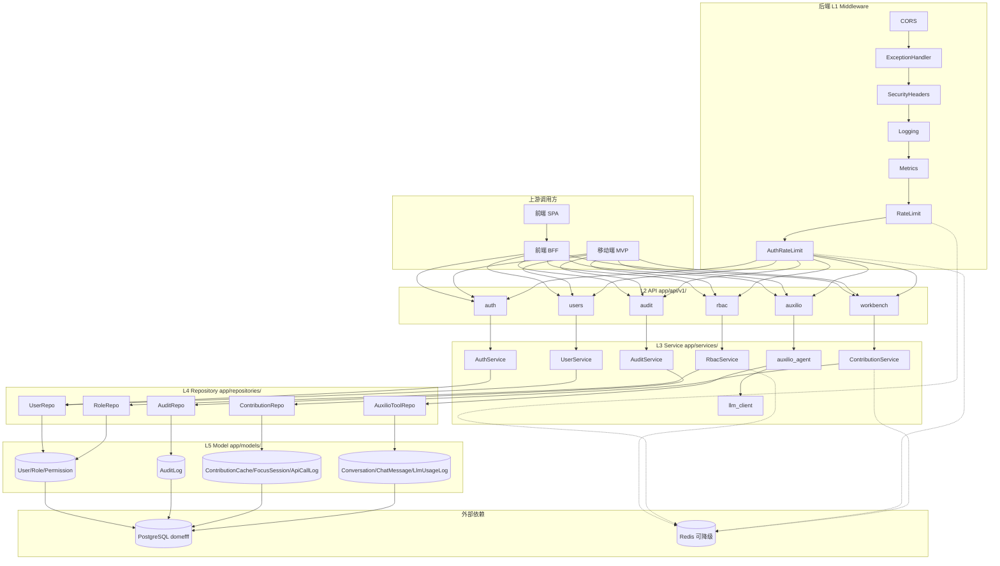
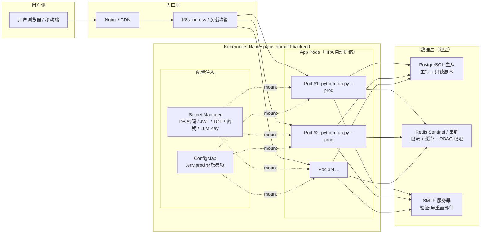

# BackDoc-01-Arch｜后端架构设计

> 更新人：3yearsZ
> 更新日：2026-08-20
> 版本：1.0.1
> Diátaxis：E（Explanation·解释）+ L3（Arc42）
> 适用读者：后端开发者、架构评审者、新成员后端入职

读完本文，你将理解后端系统的分层结构、模块边界、运行流程、部署方式与关键设计权衡。

---

## 1. 目标与约束

### 1.1 业务目标
后端为**纯 REST JSON API**，解决 3 类问题：
1. 企业级基础能力：RBAC 权限、JWT 认证、审计日志、2FA 与 OAuth 登录
2. 学习社区能力：用户资料、考试/任务/资源系统（见 [RootDoc-ModuleMap.md](file:///Users/3yearszhuang/Documents/FztbuCS-Project/docs/RootDoc-ModuleMap.md)）
3. 个人效率工作台：GitHub 贡献热力图、番茄钟、API 用量统计、可选 LLM 学习助手

### 1.2 技术约束（不可逆）
| 约束 | 说明 |
|------|------|
| Web 框架 | FastAPI 0.139 + Starlette ASGI |
| ORM / 迁移 | SQLAlchemy 2.0 async + asyncpg；**仅 Alembic** 管理 schema |
| 数据库 | PostgreSQL 专属库 `domefff`；禁止与其他项目共用 |
| 配置 | pydantic-settings v2 + `.env*`；新增字段 MUST 同步 `.env.example` |
| 测试 | pytest + httpx，`asyncio_mode=auto` |

### 1.3 质量目标优先级
1. **安全**（P0）：认证/授权/审计不可绕过
2. **可维护性**（P1）：分层单向，模块职责单一，扩展配方固定
3. **可观测性**（P1）：日志、指标、审计全链路可查
4. **性能**（P2）：Redis 可降级，不做强依赖

---

## 2. 上下文与范围

### 2.1 上游（调用方）
| 调用方 | 接入方式 | 鉴权 |
|--------|---------|------|
| 前端 SPA（工作台/社区） | BFF 反代 `/api/*` → `/api/v1/*` | JWT access token |
| 移动端 MVP | 直连 `/api/v1/*`（已冻结契约） | JWT access token |
| 管理后台 | BFF 反代 `/api/admin/*` | 管理员 2FA + `require_admin_2fa()` |

### 2.2 下游（被调用方）
| 依赖 | 用途 | 强依赖？ |
|------|------|---------|
| PostgreSQL `domefff` | 主数据存储 | 是（启动 critical） |
| Redis | 限流/缓存/RBAC 权限缓存 | 否（故障降级内存） |
| GitHub 公开贡献页 | 热力图抓取（无 OAuth） | 否（失败回退旧缓存） |
| SMTP 服务器 | 邮件验证码/密码重置 | 否（未配置回退控制台打印） |
| OpenAI / Anthropic API | 学习助手 LLM（可选） | 否（用户级或全局未配置时降级规则模式） |

### 2.3 不在范围内
- 不包含任何模板渲染、静态文件服务、前端逻辑
- 不包含前端 BFF 的转发规则（见 [FrontDoc-01-Arch.md](file:///Users/3yearszhuang/Documents/FztbuCS-Project/CS-Web-Frontend/tools/docs/FrontDoc-01-Arch.md)）
- 不包含业务模块详细路由表/参数契约（见 [RootDoc-ModuleMap.md](file:///Users/3yearszhuang/Documents/FztbuCS-Project/docs/RootDoc-ModuleMap.md) 或 `openapi.baseline.json`）

---

## 3. 构建块视图（核心）

### 3.1 分层结构 + 模块职责
后端为经典 5 层单向架构，**禁止反向或跨层 import**。

| 层级 | 根目录 | 核心模块 | 职责（1 模块 1 句话） |
|------|--------|---------|---------------------|
| L1 Middleware | `app/middleware/` | `rbac.py` `rate_limit.py` `api_usage.py` | HTTP 请求的前置拦截（鉴权、限流、埋点） |
| L2 API | `app/api/v1/` | `auth.py` `users.py` `rbac/` `audit.py` `workbench.py` `auxilio.py` | 路由定义、Pydantic 参数校验、权限依赖注入 |
| L3 Service | `app/services/` | `auth_service.py` `user_service.py` `rbac_service.py` `audit_service.py` `contribution_service.py` `auxilio_agent.py` `llm_client.py` | 业务规则编排；组合多个 Repository；不依赖 `Request`（worker 可复用） |
| L4 Repository | `app/repositories/` | `*_repo.py` 与业务模块一一对应 | 纯数据访问 CRUD；不含业务判断；只操作 Model |
| L5 Model | `app/models/` | `user.py` `role.py` `audit_log.py` `contribution_cache.py` `conversation.py` 等 | SQLAlchemy 2.0 ORM 定义；`__init__.py` 汇总导出（Alembic 依赖） |

横切基础模块（`app/core/`）：
- `config.py`：Settings 单一事实源
- `security.py` + `totp.py`：JWT 签发、bcrypt、TOTP 2FA
- `exceptions/`：`BaseAppException` 子类 + 全局处理器 + `ErrorCode` 注册表
- `redis_client.py` `cache.py` `rate_limit.py`：Redis 可降级的缓存/限流
- `loguru_logger.py`：`get_logger()` 统一入口
- `lifecycle/`：启动/关闭任务注册表

### 3.2 模块依赖图（Mermaid）



调用约束：
1. 箭头方向唯一：Middleware → API → Service → Repository → Model
2. Service 间允许调用，**MUST 通过构造函数注入**，禁止方法内 import 其他 Service
3. Repository / Model **MUST NOT** import Service / API

### 3.3 关键接口（跨层契约）
| 接口 | 位置 | 契约 |
|------|------|------|
| 权限注入 | `app/middleware/rbac.py` `require_permission(res, act)` | API 路由 `Depends()` 使用；**MUST NOT 用装饰器** |
| 会话工厂 | `app/database.py` `get_db()` / `get_session()` | 路由内 `Depends(get_db)`；路由外 `async with get_session()`；统一不自动 commit |
| 业务异常基类 | `app/core/exceptions/base.py` `BaseAppException` | Service 抛子类；全局处理器映射 HTTP 状态码 + `ErrorCode` |
| 启动任务注册表 | `app/core/lifecycle/` `@register_startup` / `@register_shutdown` | critical=True 失败中止启动；False 仅告警继续 |

---

## 4. 运行时视图

### 4.1 场景 1：邮箱登录 + 2FA（时序图）

```mermaid
sequenceDiagram
    participant U as 用户浏览器
    participant B as BFF 反代
    participant MW as 中间件链
    participant API as app/api/v1/auth.py
    participant SV as AuthService
    participant TOTP as TotpService
    participant REPO as UserRepo
    participant DB as PostgreSQL

    U->>B: POST /api/auth/login-email (email+password)
    B->>MW: 转发请求
    MW->>MW: CORS → 日志 → 限流 → 认证限流
    MW->>API: /api/v1/auth/login-email
    API->>SV: login_email(email, password)
    SV->>REPO: get_by_email(email)
    REPO->>DB: SELECT * FROM users WHERE email=$1
    DB-->>REPO: user_row + password_hash
    REPO-->>SV: User entity
    SV->>SV: bcrypt.verify(password, hash)
    alt 2FA 已启用
        SV-->>API: 返回 pre_auth_token（仅含 user_id 与 TTL）
        API-->>U: 200 { need_2fa: true, pre_auth_token }
        U->>B: POST /api/auth/2fa/verify (pre_auth_token + totp_code)
        B->>MW->>API: 转发
        API->>TOTP: verify_then_issue_token(pre_auth_token, code)
        TOTP->>TOTP: AES-GCM 解密 secret → RFC 6238 校验 ±1 窗口
        TOTP->>SV: issue_token_pair(user)
        SV->>REPO: 写入 refresh token（family+rotation）
        REPO->>DB: INSERT INTO refresh_tokens
    else 2FA 未启用
        SV->>SV: issue_token_pair(user)
        SV->>REPO: 写入 refresh token
    end
    SV-->>API: LoginResponse(access_jwt + refresh_jwt + user)
    API-->>U: 200 JSON
    MW->>MW: 反向执行（指标采集 + 日志记录）
    SV->>SV: best-effort 写入 audit_logs（user.login.success）
```

### 4.2 场景 2：工作台查询 GitHub 热力图 + 降级

```mermaid
sequenceDiagram
    participant U as 用户
    participant B as BFF
    participant MW as 中间件
    participant API as workbench.py
    participant SV as ContributionService
    participant CACHE as Redis / 内存降级
    participant REPO as ContributionRepo
    participant DB as PostgreSQL
    participant GH as github.com/users/<name>/contributions

    U->>B: GET /api/workbench/contributions/github
    B->>MW->>API: 转发，JWT 鉴权通过
    API->>SV: get_github_heatmap(user_id, username?, year?, refresh?)
    SV->>CACHE: rbac:contrib_cache:{user_id}:{year}
    alt 命中缓存 且 refresh!=true 且 TTL≤6h
        CACHE-->>SV: 缓存数据（可能 stale=true）
    else 缓存未命中 / 过期 / 强制刷新
        SV->>GH: GET contributions 页面
        alt GH 抓取成功
            GH-->>SV: HTML（解析 data-count rect 或 td+tooltip）
            SV->>REPO: upsert contribution_cache
            REPO->>DB: UPSERT INTO contribution_cache
            SV->>CACHE: 写入 6h TTL
        else GH 抓取失败
            SV->>SV: 回退旧缓存 + stale=true
            alt 无旧缓存
                SV-->>API: 抛 ContributionFetchError（映射 5xx）
            end
        end
    end
    SV-->>API: HeatmapResponse(days[], total, streak, stale?)
    API-->>U: 200 JSON
```

---

## 5. 部署视图

### 5.1 部署拓扑
后端为**无状态水平扩展**架构。除数据库外所有组件都可多实例。



部署形态：
- 开发：单进程 `python run.py --env 1`
- 生产：多 worker（Uvicorn `--workers` 或 K8s HPA），`run.py --env 3 --prod`
- 镜像：多阶段构建，Python 3.12 slim；`uv sync --frozen` 安装依赖

### 5.2 配置管理
所有配置遵循 **单一来源** = `Settings` 类 + `.env*` 文件。

| 配置类型 | 注入方式 | 示例 |
|---------|---------|------|
| **敏感**（DB 密码 / JWT 密钥 / TOTP 主密钥 / LLM API Key） | **MUST NOT** 写入 `.env`；生产用 K8s Secret / Secret Manager；本地用 `.env.local`（已 `.gitignore`） | `DATABASE__PASSWORD` `SECRET_KEY` `TOTP_ENCRYPTION_KEY` `LLM_API_KEY` |
| 非敏感（端口 / TTL / 开关） | `.env.production` / ConfigMap | `ACCESS_TOKEN_EXPIRE_MINUTES=15` `AUTH_ENABLED=True` |
| 启动时 fail-fast 校验 | `pydantic-settings` 校验必填项 | `TOTP_ENCRYPTION_KEY` ≥32 字节，缺则拒绝启动 |

敏感配置安全红线见 [BackDoc-02-Sec.md](file:///Users/3yearszhuang/Documents/FztbuCS-Project/CS-Web-Backend/tools/docs/BackDoc-02-Sec.md) §3。

### 5.3 扩缩容策略
- **水平扩缩（默认）**：K8s HPA 触发条件 = CPU > 70% 或内存 > 80%
  - 最小实例数 = 2（保证高可用）
  - 最大实例数 = 10（可按压测结果调整）
- **垂直扩缩**：仅用于数据库（PostgreSQL 升配）与 Redis（扩容分片）
- **无状态保证**：App Pod **MUST NOT** 本地写持久数据；会话、缓存、限流全走外部 Redis/DB
- **就绪探针**：`/readyz`（检查 DB + Redis 连通性 + RBAC seed 完成），通过后 LB 才切流量
- **存活探针**：`/healthz`（仅进程活着），失败后 kubelet 重启容器

启动/关闭任务注册表的详细执行顺序与 critical 分级见 [BackDoc-Infra.md](file:///Users/3yearszhuang/Documents/FztbuCS-Project/CS-Web-Backend/tools/docs/BackDoc-Infra.md) §2。

---

## 6. 架构决策（ADR 摘要）

| 编号 | 决策内容 | 被否决的替代方案 | 选择理由 |
|------|---------|----------------|---------|
| ADR-01 | SQLAlchemy 2.0 async + asyncpg 作 ORM | Tortoise-ORM、Django ORM、SQLModel | SQLAlchemy 生态成熟、Alembic 迁移工具链强；显式 session 控制与分层架构契合 |
| ADR-02 | Alembic 作**唯一** schema 来源 | `Base.metadata.create_all()`、手写 SQL 脚本 | `create_all` 无法追踪增量迁移；手写漂移风险高；Alembic 支持 downgrade + 多 head 检测 |
| ADR-03 | JWT access + refresh 双令牌 + family rotation | 纯 Session-Cookie、单一长时效 JWT | 双令牌兼顾安全（短 access）与体验（长 refresh）；family rotation 检测 token 泄露重用 |
| ADR-04 | 权限用 `Depends(require_permission)` 依赖注入 | 装饰器 `@require_permission` | 依赖注入参数显式、可组合、可测试；装饰器隐式副作用难调试、难叠加 2FA 等多条件 |
| ADR-05 | Redis 限流/缓存**可降级**内存 | Redis 做强依赖 | 开发/单机环境零依赖启动；Redis 抖动时不击穿主流程；代码路径统一避免分叉 |
| ADR-06 | LLM 学习助手默认**规则模式**，用户级 API Key 可选 | 全项目统一一个 LLM Key | 全局 LLM Key 有成本与审计风险；用户自带 Key 责任清晰；未配置时降级保证可用 |
| ADR-07 | Service 构造函数注入 DB 会话，**不引用 Request** | 在 Service 内从 `request.state` 取 db / user | 脱离 HTTP 上下文也可复用（Celery worker、脚本、CLI）；单元测试不需要 mock Request |

完整 ADR 列表与补充权衡见 [RootDoc-ADR.md](file:///Users/3yearszhuang/Documents/FztbuCS-Project/docs/RootDoc-ADR.md)。

---

## 7. 风险与技术债务

### 7.1 已知风险
| 风险 | 影响 | 缓解措施 |
|------|------|---------|
| GitHub 贡献页 HTML 改版 | 热力图解析失败 → 全部 stale | 回退旧缓存 + `stale=true`；前端展示降级提示；W-3 跟踪补测试 |
| ApiUsageMiddleware 写入量爆炸 | `api_call_logs` 表膨胀 → 慢查询 | endpoint 归一化去 ID；健康检查路由跳过；按月分区或定期归档（W-4 跟踪） |
| LLM 用户级 API Key 泄露 | AES-256-GCM 密钥若泄露 → 明文可恢复 | `TOTP_ENCRYPTION_KEY` 同时作 LLM 加密主密钥；生产 MUST 用 KMS / Secret Manager；日志掩码回显 |

### 7.2 技术债务（计划偿还）
| 债务 | 位置 | 严重度 | 计划偿还 |
|------|------|--------|---------|
| ContributionService / ApiUsageMiddleware 无专属单元测试 | `tests/` 缺口 | P1 W-3 / W-4 | 2026-09 前补齐 |
| `llm_configs` AES-GCM 与 `totp_encryption` 共用主密钥 | `app/core/totp_encryption.py` | P2 | 下一配置 refactor 拆分为 `LLM_ENCRYPTION_KEY` |
| `api_call_logs.user_id` 当前恒为 NULL（ASGI 层不解 JWT） | `app/middleware/api_usage.py` | P2 | 融合点 2 后改为 RBAC 中间件注入 user_id |

---

## 8. 术语表

| 术语 | 定义 |
|------|------|
| RBAC | Role-Based Access Control。基于角色的权限控制，用户→角色→权限三层映射 |
| JWT family rotation | refresh token 轮换机制。同一家族（family）的 token 已撤销后，超宽限窗口重用 → 全家族吊销 |
| 2FA / TOTP | Two-Factor Authentication。Time-based One-Time Password（RFC 6238），6 位数字 30 秒一换 |
| Alembic head | 迁移链的最末 revision（无子节点）。正常 MUST 单 head；多 head = 迁移分叉，CI MUST 阻断 |
| pwd_at | JWT access 内携带的 `password_changed_at` 微秒时间戳。改密后续发的 token 此字段更新，旧 access 自动失效 |
| SSE | Server-Sent Events。HTTP 长连接流式推送，`text/event-stream` Content-Type |
| Auxilio | 本项目学习助手代号，rule-based + 可选 LLM + Skills 工具调用 |
